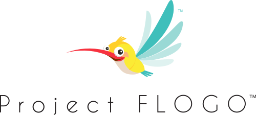

Hi! Welcome to Project Mashling&trade;, an open source event-driven microgateway.

Project Mashling highlights include:

* Ultra lightweight: 10-50x times less compute resource intensive
* Event-driven by design
* Complements Service Meshes
* Co-exists with API management platforms in a federated API Gateway model

Project Mashling is also powered by [Project Flogo](https://tibcosoftware.github.io/flogo/) is an ultralight edge microservices framework which is extensible and reusable by design, 100% open source powered by the community and supported by TIBCO.

